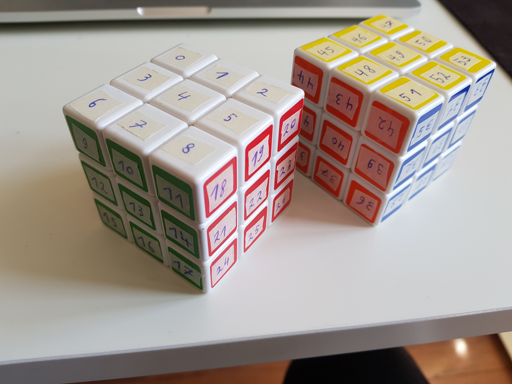
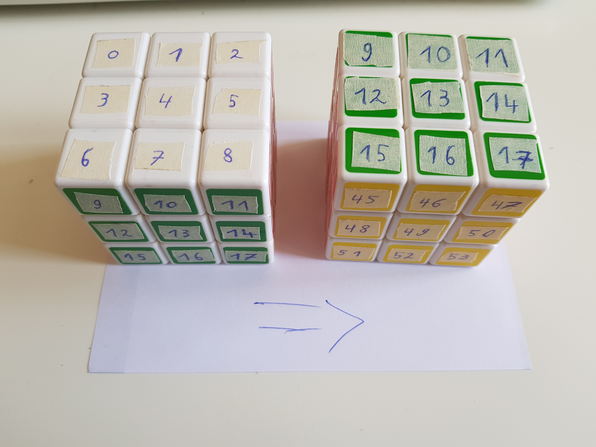
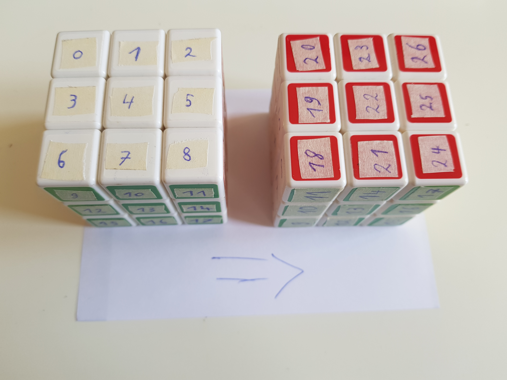
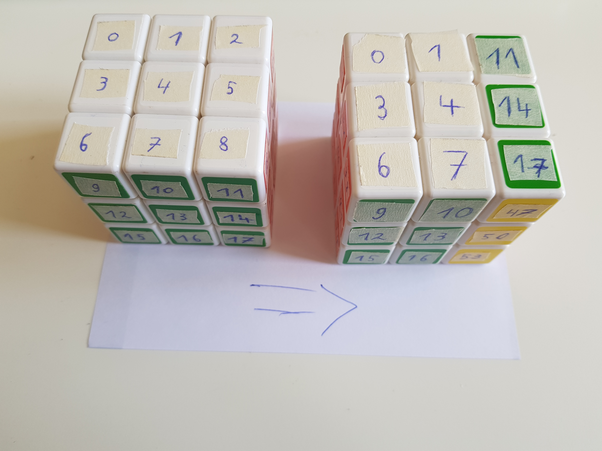

# Permuting the cube

---

<!-- 1 min: Opening -->

## Hi - I like cubes 👋

-v-

-v-

---

<!-- 1 min: what is a permutation -->

## Permutations

<ul>
   <li>Possible sequences / arrangements</li>
   <li class="fragment">$$\begin{pmatrix}1 & 2 & 3\\1 & 3 & 2\end{pmatrix}$$</li>
   <li class="fragment">$$\begin{pmatrix}1 & 3 & 2\end{pmatrix}$$</li>
</ul>

-v-

### The symmetric group

<ul>
   <li>$S_n$ - for example $S_3$</li>
   <li class="fragment">$$id = \begin{pmatrix}1 & 2 & 3\end{pmatrix}$$</li>
   <li class="fragment">$$a=\begin{pmatrix}2 & 3 & 1\end{pmatrix}$$</li>
   <li class="fragment">$$a^{-1}=\begin{pmatrix}3 & 1 & 2\end{pmatrix}$$</li>
   <li class="fragment">$$a\cdot a^{-1} = id$$</li>
</ul>

---

<!-- 1 min: permutations expose a dualism of data and function -->

---

<!-- 1 min: we can combine permutations to get new ones -->
## Combining permutations

* Let's use our previously stickered cube to make some notes!
* We'll use these as building blocks!

-v-

### The X permutation

$\rightarrow$ We get $X^{-1}$, also written $X'$ from this ;)

-v-

### The Y permutation

-v-

### The Z permutation

* Let's just do this: $X\cdot Y\cdot X'$

<video muted="true" width="640" controls>
   <source src="assets/rendered/z-perm.webm" type="video/mp4">
</video>

-v-

### The R permutation

---

<!-- 1 min: we can build rotations to orient the cube -->

---

<!-- 2 min: we can bootstrap lots of permutations from only a handful -->

---

<!-- 2 min: solving a rubiks cube -->
* each position of a cube is itself a permutation
* we search for a sequence of permutations that combines to the solution
* This can be visualised as the exploration of a graph or generating elements from a group

---

<!-- 1 min: search space is large, but we can build partial solutions -->

---

<video autoplay="true" loop="true" muted="true" width="640">
   <source src="assets/rendered/2020-05-23.superflip.mp4" type="video/mp4">
</video>

---

<video autoplay="true" loop="true" muted="true" width="640">
   <source src="assets/rendered/2020-05-26.enthusiasticon.27.mp4" type="video/mp4">
</video>

---

<video autoplay="true" loop="true" muted="true" width="640">
   <source src="assets/rendered/2020-05-25.chaotikum.mp4" type="video/mp4">
</video>

---

Slides: [github.com/runjak/2020-06-06.enthusiasticon](https://github.com/runjak/2020-06-06.enthusiasticon)
