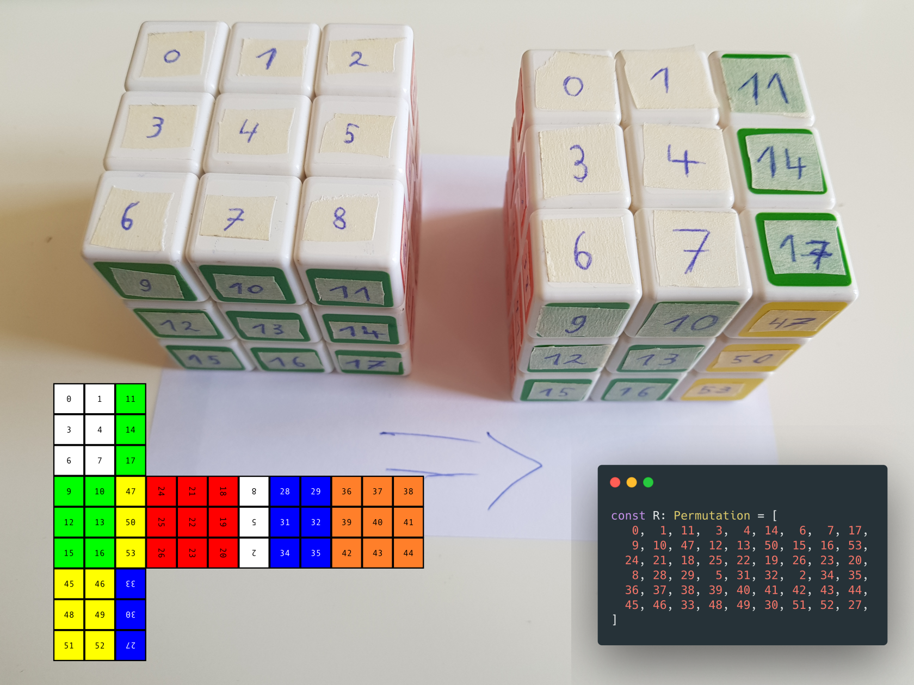
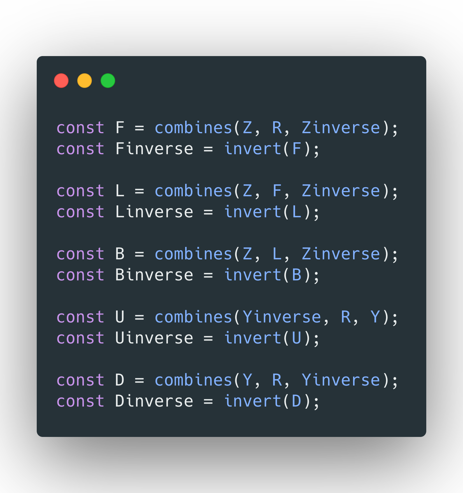
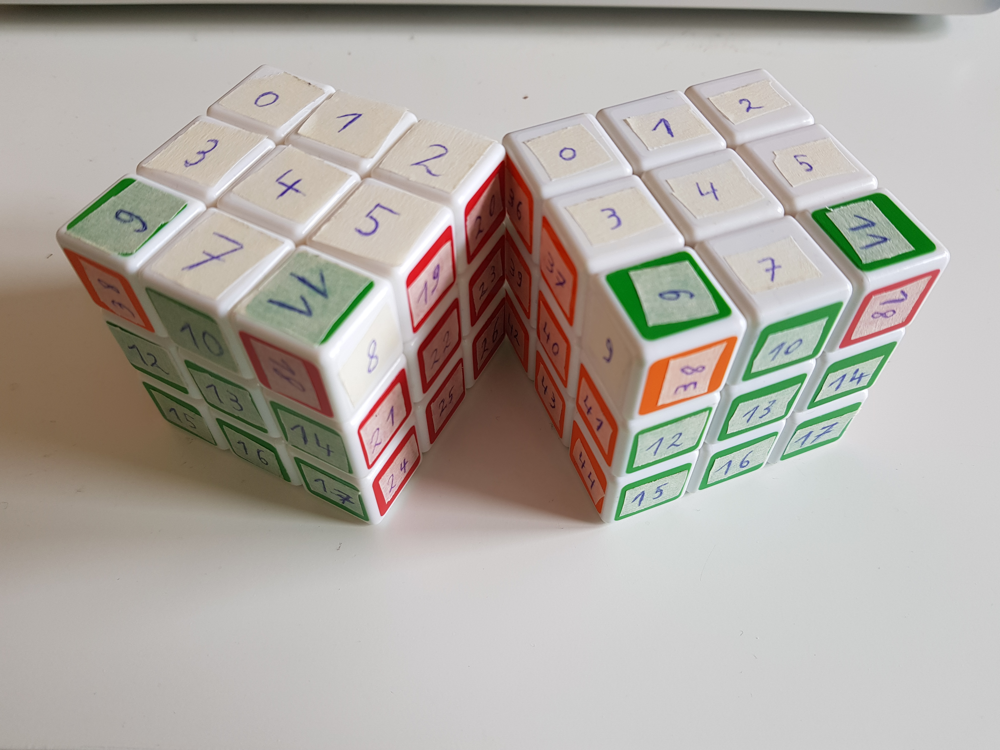

# Permuting the cube

---

## Hi - I like cubes 👋

-v-

 
[Metamagical Themas](https://en.wikipedia.org/wiki/Metamagical_Themas) - [D. Hofstadter](https://en.wikipedia.org/wiki/Douglas_Hofstadter)

-v-

## Permutations

<ul>
   <li>Possible sequences / arrangements</li>
   <li class="fragment">$$\begin{pmatrix}1 & 2 & 3\\1 & 3 & 2\end{pmatrix}$$</li>
   <li class="fragment">$$\begin{pmatrix}1 & 3 & 2\end{pmatrix}$$</li>
</ul>

-v-

### The symmetric group

<ul>
   <li>$S_n$ - in this case $S_{54}$</li>
   <li class="fragment">identity</li>
   <li class="fragment">inverse</li>
   <li class="fragment">they combine</li>
</ul>

-v-

---

### The R permutation

-v-

### The R permutation

-v-

### Orienting the cube

* Let's have some permutations to orient the cube
* They're not a direct help, but can contribute

-v-

### The X permutation

$\rightarrow$ We get $X^{-1}$, also written $X'$ from this ;)

-v-

### The Y permutation

-v-

### The Z permutation

* Let's just do this: $X\cdot Y\cdot X'$

<video muted="true" width="640" controls>
   <source src="assets/rendered/z-perm.webm" type="video/mp4">
</video>

-v-

### The F permutation

* Let's just do this: $Z\cdot R\cdot Z'$

<video muted="true" width="640" controls>
   <source src="assets/rendered/f-perm.webm" type="video/mp4">
</video>

-v-

### The whole bunch

---

## Towards solving

* each shuffle of a cube corresponds to a permutation
* we search for a sequence of permutations that combines to the solution

-v-

### example shuffle

Let's take an example:

$$
S = L\cdot D\cdot L'\cdot D'\cdot L\cdot D\cdot L'
$$

and it's inverse:

$$
S' = L\cdot D'\cdot L'\cdot D\cdot L\cdot D'\cdot L'
$$

-v-

what $S$ looks like: 
$S = L\cdot D\cdot L'\cdot D'\cdot L\cdot D\cdot L'$

<video muted="true" width="640" controls>
   <source src="assets/rendered/shuffle-1.webm" type="video/mp4">
</video>

-v-

Let's add a $U$: 
$S\cdot U$

<video muted="true" width="640" controls>
   <source src="assets/rendered/shuffle-2.webm" type="video/mp4">
</video>

-v-

And back again: 
$S\cdot U \cdot S'\cdot U'$

<video muted="true" width="640" controls>
   <source src="assets/rendered/shuffle-3.webm" type="video/mp4">
</video>

-v-

### we got us a commutator

---

<video muted="true" width="640" controls>
   <source src="assets/rendered/2020-05-26.enthusiasticon.27.mp4" type="video/mp4">
</video>

---

## Thanks for having me

* Slides: [github.com/runjak/2020-06-06.enthusiasticon](https://github.com/runjak/2020-06-06.enthusiasticon)
* Twitter: [@sicarius](https://twitter.com/sicarius)
* Happy to chat on zulip 🐋✨
